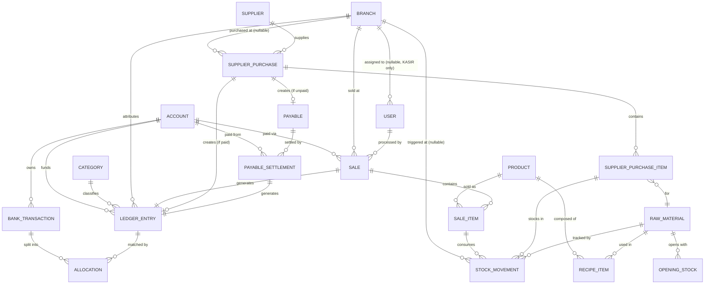

# OhMyPos — ERD (Entity Relationship Design)

**Status:** Draft v4
**Depends on:** PRD v1.1, System Design v5, ADR-001 through ADR-025

**Changelog (v3 → v4):** §3a added — the v2 tenancy entities (`Tenant`, `PlatformAdmin`, `ImpersonationSession`) and the `tenantId` column that every business entity now carries (ADR-025). §4 gains the tenant relationships. Note the reversal this represents: §1 below still records that Kasync's multi-tenant `userId` FK was deliberately dropped during the port, and that decision now stands only as history.

**Changelog (v2 → v3):** §2 (ported entities) rewritten against Kasync's literal `prisma/schema.prisma` per ADR-012 — this closes the open item v2 itself raised in §7. Corrections: `LedgerEntry.branchId` is **not** new (Kasync already has it, required); `LedgerEntry.accountId` **is** new and was missing from v2 entirely; the shared `TransactionType {INFLOW, OUTFLOW}` enum replaces v2's `enum(INCOME, EXPENSE)`; `TransactionStatus` restored to Kasync's four values; `BankTransaction` and `Allocation` regain the fields that carry import de-duplication and allocation idempotency. `User.isActive` added — ADR-011 §5 requires Owner-only deactivation, and v2 gave it nowhere to be stored. §6 gains Decimal precision rules and the inherited constraint list. §7 replaced with resolved porting notes. New entities (§3) are unchanged.

**Changelog (v1 → v2):** `User` entity updated per ADR-011 (Auth & Role-Based Access Control) — `role` extended to include `ADMIN`, `refreshTokenHash` and `tokenValidFrom` added to support JWT session revocation (ported from Kasync's Auth pattern). No other entities changed. `Sale.userId` (already present in v1) confirmed sufficient for cashier audit trail — no new field added there.

---

## 1. Entity Groups

Entities are grouped the same way as System Design Section 4: **ported** (adapted from Kasync, same responsibility) and **new** (built for OhMyPos).

Per ADR-012, the ported entities below have been reconciled field-by-field against Kasync's literal `prisma/schema.prisma`. Rows marked **new** do not exist in Kasync and must be written for OhMyPos; every unmarked row can be copied across as-is. One field is removed rather than added: Kasync's multi-tenant `userId` FK is dropped from all four ported tables (ADR-011 — single business), which also removes the `userId` parameter from every ported service method. **(v2: ADR-025 reintroduces tenancy under a different name and a different shape — a `tenantId` FK to a first-class `Tenant` entity, resolved server-side rather than threaded through service signatures. See §3a.)**

## 2. Ported Entities

### Shared enums (verbatim from Kasync — see ADR-012)

| Enum | Values |
|---|---|
| `AccountType` | `BANK`, `CASH`, `EWALLET` |
| `TransactionType` | `INFLOW`, `OUTFLOW` — the single direction enum, shared by `BankTransaction`, `LedgerEntry`, and `Category`. `INFLOW` = pemasukan, `OUTFLOW` = pengeluaran; that translation lives in the UI, not the schema |
| `TransactionStatus` | `UNRESOLVED`, `PENDING_REVIEW`, `PARTIALLY_ALLOCATED`, `MATCHED` — `trg_sync_transaction_status` writes these literals, and `MatchingEngine` uses `PENDING_REVIEW`. Do not rename |
| `AllocationStatus` | `ACTIVE`, `REVOKED` |
| `LedgerSourceType` | `MANUAL`, `SALE`, `PURCHASE`, `PAYABLE_SETTLEMENT` — **new**, OhMyPos only |
| `UserRole` | `KASIR`, `ADMIN`, `OWNER` — **new**, OhMyPos only (ADR-011) |

### `Account`
| Field | Type | Notes |
|---|---|---|
| id | uuid (PK) | |
| name | string | |
| type | `AccountType` | |
| openingBalance | Decimal(18,2) | **new** — Kas Awal per PRD §5.1; Kasync's `Account` has no balance column |
| createdAt / updatedAt | DateTime | |

### `Category`
| Field | Type | Notes |
|---|---|---|
| id | uuid (PK) | |
| name | string, unique | Kasync's unique is `(userId, name)`; with `userId` dropped it becomes `name` alone |
| type | `TransactionType` | **new** — Kasync's `Category` is `id`/`name` only |
| createdAt / updatedAt | DateTime | **new** — Kasync's `Category` has no timestamps |

### `Branch`
| Field | Type | Notes |
|---|---|---|
| id | uuid (PK) | |
| name | string, unique | as above — `(userId, name)` collapses to `name` |
| address | string, nullable | **new** |
| isSystem | boolean, default false | **new** (TASK-120) — the ADR-014 ledger-attribution row, `Umum`. A *scope*, not a place: no POS screen, no staff, hidden from the store list. This flag, **not the name**, is the lookup key used by `resolveLedgerBranchId`. Partial unique index `branches_single_system` allows at most one |
| isMainStore | boolean, default false | **new** (TASK-120) — the Owner's first store, set automatically on the first non-system branch. Currently a label with no functional meaning. Partial unique index `branches_single_main_store` allows at most one |
| createdAt / updatedAt | DateTime | **new** — Kasync's `Branch` has no timestamps |

### `LedgerEntry` — **extended** from Kasync
| Field | Type | Notes |
|---|---|---|
| id | uuid (PK) | |
| type | `TransactionType` | default `OUTFLOW`, as in Kasync |
| amount | Decimal(18,2) | |
| entryDate | DateTime | |
| accountId | uuid (FK → Account) | **new, required** — Kasync's `LedgerEntry` has no account link at all (only `BankTransaction` does). Required by System Design §6.1, which tags each sale's entry with the `Account` matching the payment method used |
| categoryId | uuid (FK → Category) | **required**, matching Kasync. Consequence: the seed must provide system categories, because a sale-generated or settlement-generated entry cannot be uncategorised (ADR-012) |
| branchId | uuid (FK → Branch) | required — **already present in Kasync**, not an OhMyPos addition (ERD v2 said otherwise) |
| sourceType | `LedgerSourceType` | **new** — distinguishes Kasync's original manual entries from OhMyPos's system-generated ones |
| sourceId | uuid, nullable | **new** — points back to the `Sale`, `SupplierPurchase`, or `PayableSettlement` that generated this entry, when `sourceType != MANUAL` |
| note | string, nullable | Kasync's field name; kept per ADR-012 (ERD v2 called this `description`, which would collide conceptually with `BankTransaction.description`) |
| createdAt / updatedAt | DateTime | |

This is the ported table with the most real change. Three fields are genuinely new — `accountId`, `sourceType`, `sourceId` — needed for payment-method attribution (System Design §6.1) and for tracing a ledger entry back to the POS/purchase event that created it. `branchId` is inherited from Kasync unchanged and already satisfies ADR-004's attribution requirement.

### `BankTransaction`
| Field | Type | Notes |
|---|---|---|
| id | uuid (PK) | |
| accountId | uuid (FK → Account) | |
| txnDate | DateTime | Kasync's field name, kept per ADR-012 |
| amount | Decimal(18,2) | |
| type | `TransactionType` | default `OUTFLOW`; compared against `LedgerEntry.type` during allocation and matching |
| description | string | required, unlike `LedgerEntry.note` |
| externalRef | string, nullable | raw reference/ID from the bank statement — half of the import de-duplication |
| dedupHash | string, nullable | the other half; see the unique constraints in §6 |
| status | `TransactionStatus` | default `UNRESOLVED`; stored, trigger-synced denormalized field |
| importedAt | DateTime | |
| createdAt / updatedAt | DateTime | |

### `Allocation`
| Field | Type | Notes |
|---|---|---|
| id | uuid (PK) | |
| bankTransactionId | uuid (FK → BankTransaction) | |
| ledgerEntryId | uuid (FK → LedgerEntry) | |
| amountPortion | Decimal(18,2) | |
| status | `AllocationStatus` | default `ACTIVE` |
| revokedAt | DateTime, nullable | set when `status` becomes `REVOKED` — revocation is a state change, never a delete |
| idempotencyKey | string, nullable | drives idempotent allocation creation in `AllocationService.create` |
| createdAt | DateTime | **append-only — no `updatedAt`** (ERD v2 listed one; Kasync has none) |

Constraint (unchanged from Kasync): `sum(Allocation.amountPortion)` per `bankTransactionId`, counting `ACTIVE` rows only, `<=` that `BankTransaction.amount` — enforced via the `trg_check_allocation_sum` PostgreSQL trigger with a `FOR UPDATE` lock on the bank transaction row. This is exactly the mechanism ADR-004 relies on to resolve cross-branch cash mixing, now allocating across `LedgerEntry` rows that may belong to different branches.

### `User` — **extended per ADR-011**
| Field | Type | Notes |
|---|---|---|
| id | uuid (PK) | |
| name | string | |
| email | string, unique | |
| passwordHash | string | bcrypt, matching Kasync's implementation |
| refreshTokenHash | string, nullable | ported from Kasync's Auth pattern, supports refresh-token rotation |
| role | `UserRole` | **new** — Kasync's `User` has no role concept |
| branchId | uuid (FK → Branch), nullable | **new** — required if role = KASIR, null if role = ADMIN or OWNER (unscoped, all-branch access) |
| isActive | boolean, default `true` | **new** — ADR-011 §5 gives `OWNER` the power to deactivate users; this is where that state lives. Deactivation is a soft state change, never a row delete, so `Sale.userId` audit history survives it |
| tokenValidFrom | DateTime | ported from Kasync, enables immediate session revocation on logout/credential change — also the mechanism that kills an active session the moment a user is deactivated |
| createdAt / updatedAt | DateTime | |

Kasync's `User` also carries `photoUrl` (Cloudinary-backed); OhMyPos does not port it — see the porting notes in §7.

Access rules (ADR-011): only `OWNER` may create/deactivate `User` records — no self-registration, no approval workflow. Reconciliation matching (`Allocation` create/revoke) is restricted to `ADMIN` and `OWNER`. `KASIR` access is scoped to `branchId` via `BranchScopeGuard`.

## 3. New Entities

### `Product`
| Field | Type | Notes |
|---|---|---|
| id | uuid (PK) | |
| name | string | |
| sellPrice | Decimal | |
| wastePercent | Decimal(5,2) | waste/susut allowance, 0–100, default 0 (ADR-024) |
| isActive | boolean | |
| createdAt / updatedAt | DateTime | |

Note: no `hpp` column — HPP is computed live from `RecipeItem` + `RawMaterial.unitCost` per ADR-005, never stored on `Product`.

`wastePercent` is an **HPP allowance only** (ADR-024): `hpp = round2(Σ(quantityUsed × unitCost) × (1 + wastePercent/100))`, applied after the recipe sum and rounded once. It never increases physical stock deduction — `RecipeItem.quantityUsed` is what a sale consumes.

### `RecipeItem` (bill of materials)
| Field | Type | Notes |
|---|---|---|
| id | uuid (PK) | |
| productId | uuid (FK → Product) | |
| rawMaterialId | uuid (FK → RawMaterial) | |
| quantityUsed | Decimal | in `RawMaterial.unit`, i.e. the STOCK/RECIPE unit (ADR-024) |
| createdAt / updatedAt | DateTime | |

Constraint: unique(`productId`, `rawMaterialId`).

### `RawMaterial`
| Field | Type | Notes |
|---|---|---|
| id | uuid (PK) | |
| name | string | |
| unit | string | **STOCK/RECIPE base unit** — gram, ml, pcs. Immutable once any `StockMovement` exists (ADR-024) |
| purchaseUnit | string | the pack the supplier sells — kg, liter, ekor, pack. Editable (ADR-024) |
| conversionFactor | Decimal(18,4) | how many `unit` in one `purchaseUnit`; `1 ekor = 10 pcs` → 10. Default 1 |
| unitCost | Decimal(18,6) | current cost per **stock** unit; written by the latest applicable purchase (ADR-024) |
| currentStock | Decimal | denormalized running balance in `unit`, synced from `StockMovement` (ADR-007) |
| lowStockThreshold | Decimal | in `unit`; drives the automatic stock status badge |
| createdAt / updatedAt | DateTime | |

Everything quantity-shaped in the system is in `unit`: `currentStock`, `lowStockThreshold`, `RecipeItem.quantityUsed`, `SupplierPurchaseItem.quantity`, `StockMovement.quantity`, `OpeningStock.quantity`, and stock opname. `purchaseUnit`/`conversionFactor` exist only so purchase ENTRY can be in the pack the supplier actually sells.

`unitCost` is `Decimal(18,6)`, not `(18,2)`, because it is a **rate** and not an amount: `Rp10.000 ÷ 3.000 gram` is `3,333333/gram`, and storing `3,33` understates HPP by ~0,1% on every gram/ml material forever (ADR-024). The same widening applies to `SupplierPurchaseItem.unitCost`, `StockMovement.unitCostAtMovement`, and `OpeningStock.unitPrice`. Every value that reaches the ledger stays `Decimal(18,2)`.

### `Sale`
| Field | Type | Notes |
|---|---|---|
| id | uuid (PK) | |
| branchId | uuid (FK → Branch) | required |
| accountId | uuid (FK → Account) | payment method used |
| userId | uuid (FK → User) | cashier who made the sale — confirmed sufficient for staff audit trail per ADR-011, no separate field needed |
| ledgerEntryId | uuid (FK → LedgerEntry), unique | the income entry this sale generated |
| totalAmount | Decimal | |
| soldAt | DateTime | |
| createdAt / updatedAt | DateTime | |

### `SaleItem`
| Field | Type | Notes |
|---|---|---|
| id | uuid (PK) | |
| saleId | uuid (FK → Sale) | |
| productId | uuid (FK → Product) | |
| quantity | Decimal | |
| unitPriceAtSale | Decimal | snapshot, may be manually overridden |
| isPriceOverridden | boolean | |
| hppAtSale | Decimal | snapshot per ADR-005 |
| lineTotal | Decimal | |
| createdAt / updatedAt | DateTime | |

### `Supplier`
| Field | Type | Notes |
|---|---|---|
| id | uuid (PK) | |
| name | string | |
| contact | string, nullable | |
| createdAt / updatedAt | DateTime | |

### `SupplierPurchase`
| Field | Type | Notes |
|---|---|---|
| id | uuid (PK) | |
| supplierId | uuid (FK → Supplier) | |
| branchId | uuid (FK → Branch), nullable | null = central purchase, per ADR-004 / confirmed policy |
| totalAmount | Decimal | |
| purchaseDate | DateTime | |
| paymentStatus | enum(PAID, UNPAID, PARTIALLY_PAID) | |
| ledgerEntryId | uuid (FK → LedgerEntry), nullable | set immediately if `paymentStatus = PAID` at creation; null while unpaid, per ADR-006 |
| createdAt / updatedAt | DateTime | |

### `SupplierPurchaseItem`
| Field | Type | Notes |
|---|---|---|
| id | uuid (PK) | |
| supplierPurchaseId | uuid (FK → SupplierPurchase) | |
| rawMaterialId | uuid (FK → RawMaterial) | |
| purchaseQuantity | Decimal(18,4) | WHAT WAS BOUGHT — quantity in the purchase unit, as entered (ADR-024) |
| purchaseUnit | string | snapshot of `RawMaterial.purchaseUnit` at recording time |
| conversionFactor | Decimal(18,4) | snapshot of `RawMaterial.conversionFactor` at recording time |
| quantity | Decimal(18,4) | WHAT STOCK RECEIVED — `purchaseQuantity × conversionFactor`, in the stock unit |
| unitCost | Decimal(18,6) | derived — `lineTotal ÷ quantity`, per stock unit |
| lineTotal | Decimal(18,2) | the TOTAL price entered for this line; the input the other two derive from |

The three snapshot columns are why editing a material's packaging is safe: a historical line carries its own copy, so it never moves (ADR-024). `SupplierPurchase.totalAmount` is the sum of the `lineTotal` values actually stored.

### `Payable`
| Field | Type | Notes |
|---|---|---|
| id | uuid (PK) | |
| supplierPurchaseId | uuid (FK → SupplierPurchase), unique | |
| supplierId | uuid (FK → Supplier) | |
| originalAmount | Decimal | |
| remainingBalance | Decimal | |
| status | enum(OPEN, PARTIALLY_SETTLED, SETTLED) | |
| createdAt / updatedAt | DateTime | |

### `PayableSettlement`
| Field | Type | Notes |
|---|---|---|
| id | uuid (PK) | |
| payableId | uuid (FK → Payable) | |
| accountId | uuid (FK → Account) | account the payment came from |
| ledgerEntryId | uuid (FK → LedgerEntry), unique | the expense entry this settlement generated, per ADR-006 |
| amount | Decimal | |
| settledAt | DateTime | |
| createdAt / updatedAt | DateTime | |

### `StockMovement`
| Field | Type | Notes |
|---|---|---|
| id | uuid (PK) | |
| rawMaterialId | uuid (FK → RawMaterial) | |
| branchId | uuid (FK → Branch), nullable | attribution only (which branch triggered it); null for central events like `OPENING` |
| direction | enum(IN, OUT) | |
| quantity | Decimal | |
| referenceType | enum(SALE, PURCHASE, OPENING, ADJUSTMENT) | |
| referenceId | uuid, nullable | points to the `Sale`, `SupplierPurchase`, or `OpeningStock` row that caused this movement |
| unitCostAtMovement | Decimal(18,6) | snapshot, per **stock** unit, for historical costing accuracy |
| movementDate | DateTime | |
| createdAt | DateTime | append-only — no `updatedAt` |

### `OpeningStock`
| Field | Type | Notes |
|---|---|---|
| id | uuid (PK) | |
| rawMaterialId | uuid (FK → RawMaterial) | |
| periodMonth | Date | first day of the month this applies to |
| quantity | Decimal | the declared physical count, in `RawMaterial.unit` (ADR-024) |
| unitPrice | Decimal(18,6), nullable | required if no purchase has happened in the period; must be omitted/null if a purchase already exists (PRD §5.5, Phase 6) |
| createdAt / updatedAt | DateTime | |

Constraint: unique(`rawMaterialId`, `periodMonth`).

## 3a. Tenancy Entities (v2 — ADR-025)

### `Tenant`
| Field | Type | Notes |
|---|---|---|
| `id` | `String @id @default(uuid())` | `TEXT` in Postgres, matching every other id in this schema — no column here uses `@db.Uuid` |
| `name` | `String` | |
| `slug` | `String @unique` | Operator-facing handle. **Not** used for routing — tenancy is resolved from the `User` record, not the URL |
| `status` | `TenantStatus` | `ACTIVE` \| `SUSPENDED` |
| `createdAt` / `updatedAt` | `DateTime` | |

`BusinessProfile` is **not** folded into `Tenant`. `Tenant` holds what the platform operator owns; `BusinessProfile` stays what the tenant edits about itself, linked by `tenantId @unique`.

### `PlatformAdmin`
| Field | Type | Notes |
|---|---|---|
| `id` | `String @id @default(uuid())` | |
| `name`, `email` | `String`, `String @unique` | |
| `passwordHash` | `String` | bcrypt, 10 rounds, same as `User` |
| `refreshTokenHash` | `String?` | |
| `isActive` | `Boolean @default(true)` | |
| `tokenValidFrom` | `DateTime` | Same revocation pattern as `User` (ADR-011 §3) |

Deliberately **not** a row in `users` and **not** a `UserRole` member. That is what allows `User.tenantId` to be `NOT NULL` with no exceptions — see ADR-025 Decision 5.

### `ImpersonationSession`
| Field | Type | Notes |
|---|---|---|
| `id` | `String @id @default(uuid())` | |
| `platformAdminId` | `String` | FK → `PlatformAdmin`, Restrict |
| `tenantId` | `String` | FK → `Tenant`, Restrict |
| `actingAsUserId` | `String` | The tenant `OWNER` whose identity was borrowed |
| `reason` | `String` | Required |
| `startedAt` / `endedAt` | `DateTime` / `DateTime?` | Append-only except `endedAt` |

### `tenantId` on every business entity

All 23 business entities gain `tenantId TEXT NOT NULL` with an FK to `Tenant` (`onDelete: Restrict`) — **including child tables** (`SaleItem`, `RecipeItem`, `SupplierPurchaseItem`, `Allocation`, `AttendanceRecord`) where it is redundant against the parent. The redundancy is deliberate: a uniform column is what lets the Prisma filter be one `$allModels` rule with no special cases.

Consistency between a child's `tenantId` and its parent's is enforced by composite foreign keys — 13 parent tables carry `UNIQUE (id, tenant_id)`, and 35 child FKs reference `(id, tenant_id)`, all `DEFERRABLE INITIALLY DEFERRED` so they settle after the existing `CASCADE`/`SET NULL` actions. Two columns are outside this protection because they are polymorphic by design and carry no FK at all: `LedgerEntry.sourceId` and `StockMovement.referenceId`.

Uniqueness moves to `@@unique([tenantId, name])` on `Category`, `Branch`, `RawMaterial`, `Product`, `Supplier`, and to `@@unique([tenantId, idempotencyKey])` on `Sale`, `SupplierPurchase`, `PayableSettlement`. Two stay globally unique on purpose: `User.email` (one email = one account = one tenant, which keeps the login flow untouched) and `Device.activationCode` (activation happens before any tenant context exists).

## 4. Relationships Summary

- `Account` 1—* `LedgerEntry`, `Account` 1—* `BankTransaction`, `Account` 1—* `Sale`, `Account` 1—* `PayableSettlement`
- `Category` 1—* `LedgerEntry`
- `Branch` 1—* `LedgerEntry`, `Branch` 1—* `Sale`, `Branch` 0..1—* `SupplierPurchase`, `Branch` 0..1—* `StockMovement`, `Branch` 0..1—* `User`
- `BankTransaction` 1—* `Allocation` *—1 `LedgerEntry`
- `Product` 1—* `RecipeItem` *—1 `RawMaterial`
- `Product` 1—* `SaleItem`
- `Sale` 1—* `SaleItem`, `Sale` 1—1 `LedgerEntry`, `Sale` *—1 `User` (cashier)
- `RawMaterial` 1—* `StockMovement`, `RawMaterial` 1—* `SupplierPurchaseItem`, `RawMaterial` 1—* `OpeningStock`
- `Supplier` 1—* `SupplierPurchase`
- `SupplierPurchase` 1—* `SupplierPurchaseItem`, `SupplierPurchase` 0..1—1 `Payable`, `SupplierPurchase` 0..1—1 `LedgerEntry`
- `Payable` 1—* `PayableSettlement` *—1 `LedgerEntry`
- **(v2)** `Tenant` 1—* every business entity listed above; `Tenant` 1—1 `BusinessProfile`
- **(v2)** `PlatformAdmin` 1—* `ImpersonationSession` *—1 `Tenant`

## 5. Combined Diagram

## 6. Constraints & Indexes Worth Calling Out

### Decimal precision (ADR-012)

- **Money** — `Decimal(18, 2)`, matching Kasync: `amount`, `amountPortion`, `openingBalance`, `unitCost`, `sellPrice`, `totalAmount`, `lineTotal`, `unitPriceAtSale`, `hppAtSale`, `originalAmount`, `remainingBalance`, `unitPrice`, `unitCostAtMovement`.
- **Quantity** — `Decimal(18, 4)`: `quantityUsed`, `currentStock`, `lowStockThreshold`, `quantity` on `SaleItem` / `SupplierPurchaseItem` / `StockMovement` / `OpeningStock`. Two decimal places cannot represent realistic recipe quantities in kg or liter.

### Inherited from Kasync (do not drop when porting)

- `BankTransaction`: unique on (`accountId`, `externalRef`) **and** unique on (`accountId`, `dedupHash`) — together these prevent importing the same bank statement row twice into one account.
- `Allocation`: unique on (`bankTransactionId`, `idempotencyKey`) — makes repeated allocation-create calls idempotent rather than duplicating.
- `BankTransaction`: index on `txnDate`, index on `status`. `LedgerEntry`: index on `entryDate`, `categoryId`, `branchId`. `Allocation`: index on `bankTransactionId`, `ledgerEntryId`.
- Cascade behaviour: `BankTransaction` → `Account`, and `Allocation` → both parents, are `ON DELETE CASCADE` (see Kasync's `migrations/cascades/migration.sql`).

### OhMyPos-specific

- `LedgerEntry`: index on (`branchId`, `entryDate`) — every report in Dashboard 3 filters by date and often by branch.
- `StockMovement`: index on (`rawMaterialId`, `movementDate`) — drives Dashboard 5's inventory summary calculations.
- `RawMaterial.currentStock` updates only ever happen inside the same transaction as the `StockMovement` row that justifies the change, guarded by `SELECT ... FOR UPDATE` on `RawMaterial` (ADR-007).
- `Allocation` retains Kasync's allocation-sum trigger unchanged, now operating over `LedgerEntry` rows that carry a `branchId`.
- `SupplierPurchase.ledgerEntryId` and `Payable` are mutually exclusive by construction: a purchase either gets a `LedgerEntry` immediately (paid) or a `Payable` (unpaid), never both at creation time (ADR-006).
- `OpeningStock` unique on (`rawMaterialId`, `periodMonth`) prevents recording opening stock twice for the same material in the same month.
- `User.branchId`: index recommended — `BranchScopeGuard` filters on this for every KASIR-scoped request (ADR-011).

## 7. Porting Notes (v2's open item, now resolved)

ERD v2 closed with an open item: cross-check the field-level types against Kasync's actual `schema.prisma`. That has been done (ADR-012), and §2 above now reflects the literal schema. What follows is the residue of that exercise — traps that are invisible from the schema alone and that cost real time if discovered mid-port.

1. **Strip multi-tenancy from every ported service, not just the schema.** Dropping the `userId` FK is the easy half. Kasync's services take `userId` as a parameter on *every* method and filter with `findFirst({ where: { id, userId } })` (see `accounts.service.ts`, `categories.service.ts`, `branches.service.ts`, `ledger-entries.service.ts`, `allocation.service.ts`, `matching.service.ts`). All of that scoping comes out, and `findFirst` generally becomes `findUnique`. Kasync's ported tests assert on this scoping, so they need rewriting rather than re-pointing.
2. **Do not port `POST /auth/register`.** Kasync's is `@Public()` self-registration. ADR-011 §5 permits user creation by `OWNER` only, with no self-registration path — porting this endpoint would silently reopen the exact hole the ADR closes.
3. **Do not port `DELETE /users/me`.** Kasync lets a user delete their own account. OhMyPos deactivation is `OWNER`-only and soft (`User.isActive`), because `Sale.userId` is an audit trail that must survive the user leaving.
4. **~~Do not port `photoUrl` / `POST /users/me/photo`.~~ (Superseded by ADR-020)** Originally excluded as unnecessary dependency. Re-introduced in Phase 10b via ADR-020 following explicit feature request for profile photo self-service with Cloudinary backend storage.
5. **`BankTransaction` is not a standalone module in Kasync.** It is a table written by the `import` module (the `BankParser` strategy pattern, with the CSV parsers under `src/modules/import/parsers/`) and read by the `reconciliation` module. Any task list naming "the BankTransaction module" means those two — see System Design §4.
6. **Copy the triggers verbatim from the migration files, not from this document.** `trg_check_allocation_sum` and `trg_sync_transaction_status` live in `../kasync/prisma/migrations/20260808085205_init/migration.sql`, with a corrected re-definition in `20260809180000_multi_tenancy_and_triggers/migration.sql` (that later version adds a `::text` cast before the enum cast — take the later one). Their `FOR UPDATE` lock is what makes the allocation-sum invariant hold under concurrency, per Playbook §7.
7. **Kasync validates with `class-validator`; OhMyPos does not.** Per ADR-010, every ported DTO is replaced by a Zod schema in `packages/api-contracts`. Do not carry the decorator-based DTOs across.