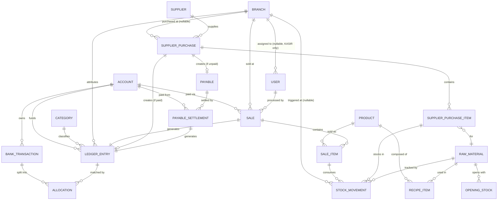

# OhMyPos — ERD (Entity Relationship Design)

**Status:** Draft v2
**Depends on:** PRD v1, System Design v2, ADR-001 through ADR-011

**Changelog (v1 → v2):** `User` entity updated per ADR-011 (Auth & Role-Based Access Control) — `role` extended to include `ADMIN`, `refreshTokenHash` and `tokenValidFrom` added to support JWT session revocation (ported from Kasync's Auth pattern). No other entities changed. `Sale.userId` (already present in v1) confirmed sufficient for cashier audit trail — no new field added there.

---

## 1. Entity Groups

Entities are grouped the same way as System Design Section 4: **ported** (adapted from Kasync, same responsibility) and **new** (built for OhMyPos). Field-level detail below should be checked against Kasync's actual `schema.prisma` when porting — the ported entities here reflect what's documented in Kasync's own ERD/ADRs, plus the specific extensions OhMyPos needs (called out explicitly where they occur).

## 2. Ported Entities

### `Account`
| Field | Type | Notes |
|---|---|---|
| id | uuid (PK) | |
| name | string | |
| type | enum(CASH, BANK, EWALLET) | |
| openingBalance | Decimal | |
| createdAt / updatedAt | DateTime | |

### `Category`
| Field | Type | Notes |
|---|---|---|
| id | uuid (PK) | |
| name | string | |
| type | enum(INCOME, EXPENSE) | |
| createdAt / updatedAt | DateTime | |

### `Branch`
| Field | Type | Notes |
|---|---|---|
| id | uuid (PK) | |
| name | string | |
| address | string, nullable | |
| createdAt / updatedAt | DateTime | |

### `LedgerEntry` — **extended** from Kasync
| Field | Type | Notes |
|---|---|---|
| id | uuid (PK) | |
| type | enum(INCOME, EXPENSE) | |
| amount | Decimal | |
| entryDate | DateTime | |
| accountId | uuid (FK → Account) | |
| categoryId | uuid (FK → Category), nullable | |
| branchId | uuid (FK → Branch) | **new, required** — every entry (manual, sale-generated, or settlement-generated) is attributed to a branch, per ADR-004 |
| sourceType | enum(MANUAL, SALE, PURCHASE, PAYABLE_SETTLEMENT) | **new** — distinguishes Kasync's original manual entries from OhMyPos's system-generated ones |
| sourceId | uuid, nullable | **new** — points back to the `Sale`, `SupplierPurchase`, or `PayableSettlement` that generated this entry, when `sourceType != MANUAL` |
| description | string, nullable | |
| createdAt / updatedAt | DateTime | |

This is the one ported table with a real schema change, not just a copy — `branchId`, `sourceType`, and `sourceId` are additions needed for ADR-004 (branch attribution) and traceability from a ledger entry back to the POS/purchase event that created it.

### `BankTransaction`
| Field | Type | Notes |
|---|---|---|
| id | uuid (PK) | |
| accountId | uuid (FK → Account) | |
| amount | Decimal | |
| description | string | |
| transactionDate | DateTime | |
| status | enum(UNMATCHED, PARTIALLY_MATCHED, MATCHED) | stored, trigger-synced denormalized field (unchanged pattern from Kasync) |
| createdAt / updatedAt | DateTime | |

### `Allocation`
| Field | Type | Notes |
|---|---|---|
| id | uuid (PK) | |
| bankTransactionId | uuid (FK → BankTransaction) | |
| ledgerEntryId | uuid (FK → LedgerEntry) | |
| amountPortion | Decimal | |
| status | enum | |
| createdAt / updatedAt | DateTime | |

Constraint (unchanged from Kasync): `sum(Allocation.amountPortion)` per `bankTransactionId` `<=` that `BankTransaction.amount`, enforced via a PostgreSQL trigger with a `FOR UPDATE` lock — this is exactly the mechanism ADR-004 relies on to resolve cross-branch cash mixing, now allocating across `LedgerEntry` rows that may belong to different branches.

### `User` — **extended per ADR-011**
| Field | Type | Notes |
|---|---|---|
| id | uuid (PK) | |
| name | string | |
| email | string, unique | |
| passwordHash | string | |
| refreshTokenHash | string, nullable | **new** — ported from Kasync's Auth pattern, supports refresh-token rotation |
| role | enum(KASIR, ADMIN, OWNER) | **updated** — `ADMIN` added; v1 draft only had `OWNER, CASHIER` |
| branchId | uuid (FK → Branch), nullable | required if role = KASIR, null if role = ADMIN or OWNER (unscoped, all-branch access) |
| tokenValidFrom | DateTime | **new** — ported from Kasync, enables immediate session revocation on logout/credential change |
| createdAt / updatedAt | DateTime | |

Access rules (ADR-011): only `OWNER` may create/deactivate `User` records — no self-registration, no approval workflow. Reconciliation matching (`Allocation` create/revoke) is restricted to `ADMIN` and `OWNER`. `KASIR` access is scoped to `branchId` via `BranchScopeGuard`.

## 3. New Entities

### `Product`
| Field | Type | Notes |
|---|---|---|
| id | uuid (PK) | |
| name | string | |
| sellPrice | Decimal | |
| isActive | boolean | |
| createdAt / updatedAt | DateTime | |

Note: no `hpp` column — HPP is computed live from `RecipeItem` + `RawMaterial.unitCost` per ADR-005, never stored on `Product`.

### `RecipeItem` (bill of materials)
| Field | Type | Notes |
|---|---|---|
| id | uuid (PK) | |
| productId | uuid (FK → Product) | |
| rawMaterialId | uuid (FK → RawMaterial) | |
| quantityUsed | Decimal | |
| createdAt / updatedAt | DateTime | |

Constraint: unique(`productId`, `rawMaterialId`).

### `RawMaterial`
| Field | Type | Notes |
|---|---|---|
| id | uuid (PK) | |
| name | string | |
| unit | string | satuan (kg, liter, pcs, etc.) |
| unitCost | Decimal | current cost per unit |
| currentStock | Decimal | denormalized running balance, synced from `StockMovement` (ADR-007) |
| lowStockThreshold | Decimal | drives the automatic stock status badge |
| createdAt / updatedAt | DateTime | |

### `Sale`
| Field | Type | Notes |
|---|---|---|
| id | uuid (PK) | |
| branchId | uuid (FK → Branch) | required |
| accountId | uuid (FK → Account) | payment method used |
| userId | uuid (FK → User) | cashier who made the sale — confirmed sufficient for staff audit trail per ADR-011, no separate field needed |
| ledgerEntryId | uuid (FK → LedgerEntry), unique | the income entry this sale generated |
| totalAmount | Decimal | |
| soldAt | DateTime | |
| createdAt / updatedAt | DateTime | |

### `SaleItem`
| Field | Type | Notes |
|---|---|---|
| id | uuid (PK) | |
| saleId | uuid (FK → Sale) | |
| productId | uuid (FK → Product) | |
| quantity | Decimal | |
| unitPriceAtSale | Decimal | snapshot, may be manually overridden |
| isPriceOverridden | boolean | |
| hppAtSale | Decimal | snapshot per ADR-005 |
| lineTotal | Decimal | |
| createdAt / updatedAt | DateTime | |

### `Supplier`
| Field | Type | Notes |
|---|---|---|
| id | uuid (PK) | |
| name | string | |
| contact | string, nullable | |
| createdAt / updatedAt | DateTime | |

### `SupplierPurchase`
| Field | Type | Notes |
|---|---|---|
| id | uuid (PK) | |
| supplierId | uuid (FK → Supplier) | |
| branchId | uuid (FK → Branch), nullable | null = central purchase, per ADR-004 / confirmed policy |
| totalAmount | Decimal | |
| purchaseDate | DateTime | |
| paymentStatus | enum(PAID, UNPAID, PARTIALLY_PAID) | |
| ledgerEntryId | uuid (FK → LedgerEntry), nullable | set immediately if `paymentStatus = PAID` at creation; null while unpaid, per ADR-006 |
| createdAt / updatedAt | DateTime | |

### `SupplierPurchaseItem`
| Field | Type | Notes |
|---|---|---|
| id | uuid (PK) | |
| supplierPurchaseId | uuid (FK → SupplierPurchase) | |
| rawMaterialId | uuid (FK → RawMaterial) | |
| quantity | Decimal | |
| unitCost | Decimal | |
| lineTotal | Decimal | |

### `Payable`
| Field | Type | Notes |
|---|---|---|
| id | uuid (PK) | |
| supplierPurchaseId | uuid (FK → SupplierPurchase), unique | |
| supplierId | uuid (FK → Supplier) | |
| originalAmount | Decimal | |
| remainingBalance | Decimal | |
| status | enum(OPEN, PARTIALLY_SETTLED, SETTLED) | |
| createdAt / updatedAt | DateTime | |

### `PayableSettlement`
| Field | Type | Notes |
|---|---|---|
| id | uuid (PK) | |
| payableId | uuid (FK → Payable) | |
| accountId | uuid (FK → Account) | account the payment came from |
| ledgerEntryId | uuid (FK → LedgerEntry), unique | the expense entry this settlement generated, per ADR-006 |
| amount | Decimal | |
| settledAt | DateTime | |
| createdAt / updatedAt | DateTime | |

### `StockMovement`
| Field | Type | Notes |
|---|---|---|
| id | uuid (PK) | |
| rawMaterialId | uuid (FK → RawMaterial) | |
| branchId | uuid (FK → Branch), nullable | attribution only (which branch triggered it); null for central events like `OPENING` |
| direction | enum(IN, OUT) | |
| quantity | Decimal | |
| referenceType | enum(SALE, PURCHASE, OPENING, ADJUSTMENT) | |
| referenceId | uuid, nullable | points to the `Sale`, `SupplierPurchase`, or `OpeningStock` row that caused this movement |
| unitCostAtMovement | Decimal | snapshot, for historical costing accuracy |
| movementDate | DateTime | |
| createdAt | DateTime | append-only — no `updatedAt` |

### `OpeningStock`
| Field | Type | Notes |
|---|---|---|
| id | uuid (PK) | |
| rawMaterialId | uuid (FK → RawMaterial) | |
| periodMonth | Date | first day of the month this applies to |
| quantity | Decimal | |
| unitPrice | Decimal | used if no purchase has happened yet that month |
| createdAt / updatedAt | DateTime | |

Constraint: unique(`rawMaterialId`, `periodMonth`).

## 4. Relationships Summary

- `Account` 1—* `LedgerEntry`, `Account` 1—* `BankTransaction`, `Account` 1—* `Sale`, `Account` 1—* `PayableSettlement`
- `Category` 1—* `LedgerEntry`
- `Branch` 1—* `LedgerEntry`, `Branch` 1—* `Sale`, `Branch` 0..1—* `SupplierPurchase`, `Branch` 0..1—* `StockMovement`, `Branch` 0..1—* `User`
- `BankTransaction` 1—* `Allocation` *—1 `LedgerEntry`
- `Product` 1—* `RecipeItem` *—1 `RawMaterial`
- `Product` 1—* `SaleItem`
- `Sale` 1—* `SaleItem`, `Sale` 1—1 `LedgerEntry`, `Sale` *—1 `User` (cashier)
- `RawMaterial` 1—* `StockMovement`, `RawMaterial` 1—* `SupplierPurchaseItem`, `RawMaterial` 1—* `OpeningStock`
- `Supplier` 1—* `SupplierPurchase`
- `SupplierPurchase` 1—* `SupplierPurchaseItem`, `SupplierPurchase` 0..1—1 `Payable`, `SupplierPurchase` 0..1—1 `LedgerEntry`
- `Payable` 1—* `PayableSettlement` *—1 `LedgerEntry`

## 5. Combined Diagram

## 6. Constraints & Indexes Worth Calling Out

- `LedgerEntry`: index on (`branchId`, `entryDate`) — every report in Dashboard 3 filters by date and often by branch.
- `StockMovement`: index on (`rawMaterialId`, `movementDate`) — drives Dashboard 5's inventory summary calculations.
- `RawMaterial.currentStock` updates only ever happen inside the same transaction as the `StockMovement` row that justifies the change, guarded by `SELECT ... FOR UPDATE` on `RawMaterial` (ADR-007).
- `Allocation` retains Kasync's allocation-sum trigger unchanged, now operating over `LedgerEntry` rows that carry a `branchId`.
- `SupplierPurchase.ledgerEntryId` and `Payable` are mutually exclusive by construction: a purchase either gets a `LedgerEntry` immediately (paid) or a `Payable` (unpaid), never both at creation time (ADR-006).
- `OpeningStock` unique on (`rawMaterialId`, `periodMonth`) prevents recording opening stock twice for the same material in the same month.
- `User.branchId`: index recommended — `BranchScopeGuard` filters on this for every KASIR-scoped request (ADR-011).

## 7. Open Item

Field-level types above (especially enums and exact `Decimal` precision/scale) should be cross-checked against Kasync's actual `schema.prisma` when this gets implemented, since this ERD was written from the documented ADRs/System Design rather than the literal Kasync schema file.